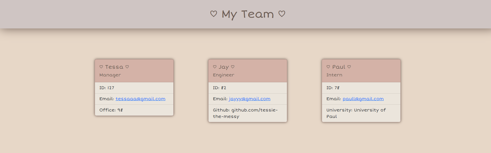

# Team Profile Generator
  

  ## Description
   ### A command line application that allows your to organize your work team.
    
  ## Table of Contents
  ### - [Installation](#installation)
  ### - [Usage](#usage)
  ### - [License](#license)
  ### - [Contact](#contact)

## Installation
Download files from the repo. Open command line, and use node index.js to initiate questions.

## Usage
For use by managers to organize emails and other info of a team of interns and engineers.

Example of final product:

## License: MIT license
For more information visit https://opensource.org/licenses/MIT
    
## Contact
For any questions/concerns, you can reach me at: tessa.elise.robinson@gmail.com
To view my github profile, and other projects, please visit: github.com/tessie-the-messy